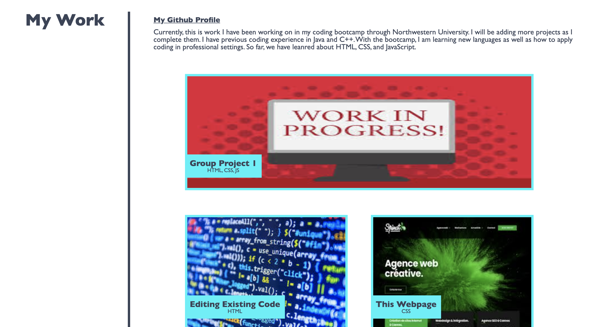
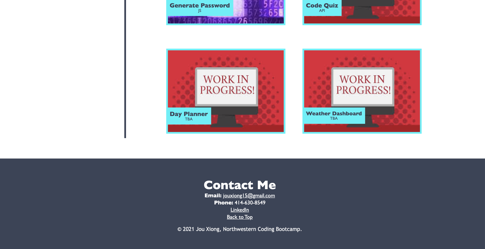

# 02 Advanced CSS: Portfolio

* Functioning Website link: https://jxiong15.github.io/02-profile/
* GitHub Repository Link: https://github.com/JXIong15/02-profile
    * Displays an online portfolio with working links to all of my projects.

## Functionalitty

* By clicking on the subheaders in the top right corner, the user will be brought to the correct section on the page.
* By clicking on the embedded links, the user will be brought to the correct websites.
* By clicking on any of the "My Work" images and text labels, the user will be brought to the working application I have completed.
* In the "Contact Me" section: T
    * The user can click on the underlined email to bring up their email application. The email line will already have my email on it.
    * By clicking on the LinkedIn link, the user is brought ot my LinkedIn profile.
    * By clicking "Back to Top" the user is brought back to the top of the website with the headings.

## Website Images
* Heading and About Me: 

* My Work: 

* Contact Me: 

## Tasks Completed

* Referenced the Horiseon code.
* Typed on index.html first to put in all of my my information without any formatting. Included pictures as well.
* Used style.css to make heading.
* Created containers.
    * container1 is the section headings to the left of the seperating line.
        * In the "About Me" section, container1 includes my picture.
    * container2 is everything on the right of the line in each section.
    * container3 is each individual small photo along with their overlapping labels in the "My Work" section.
        * Used the absolute function to overlay the text label.
    * container4 is the large image above the smaller ones in the "My Work" section.
    * container5 is the footer with the contact infomation and copyright.
* Linked correct working links. (See Functionality above)

- - -
© 2021 Jou Xiong
