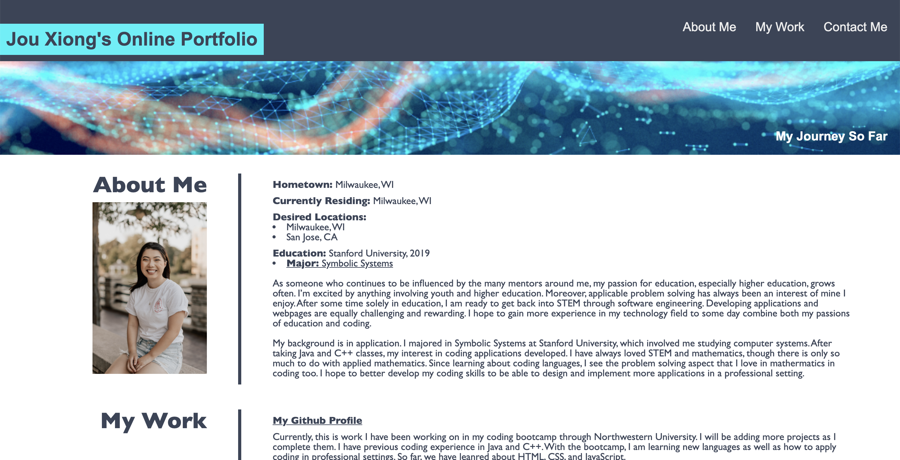

# 02 Advanced CSS: Portfolio

* Functioning Website link: https://jxiong15.github.io/02-profile/
* GitHub Repository Link: https://github.com/JXIong15/02-profile
    * Displays an online portfolio with working links to all of my projects.

## Table of Contents
* [Introduction](#introduction)
* [Functionality](#functionality)
* [New Tasks Completed](#new-tasks-completed-3/29/21)
* [Tasks Completed](#tasks-completed)
* [Technologies Used](#technologies-used)
* [Website Demos](#website-demos)
* [Known Bugs](#known-bugs)
* [Contact Me](#contact-me)

## Introduction
This is an online portfolio of my work so far as a junior software developer. It is a work in progress as I complete the Northwestern Coding Bootcamp curriculum.

## Functionality
* By clicking on the subheaders in the top right corner, the user will be brought to the correct section on the page.
* By clicking on the embedded links, the user will be brought to the correct websites.
* By clicking on any of the "My Work" images, the user will be brought to the working application I have completed.
    * By clicking on the "My Work" image labels, users will be directed to the Github repo for that project.
* In the "Contact Me" section:
    * By clicking on the underlined email, the user's default email application will open up with my email already in the recipient liine.
    * By clicking on the LinkedIn link, the user is brought ot my LinkedIn profile.
    * By clicking on the Resume link, my resume is automatically downloaded on the user's computer.
    * By clicking "Back to Top" the user is brought back to the top of the website with the headings.

## New Tasks Completed 3/29/21
* Added curves to all the image corners
    * Added a border to my profile image
* Added styling and formatting for mobile response
    * Two columns become one for solo projects
    * Font sizes are larger
    * Footer is smaller
* Added the repo links to the labels for each project
* Updated the resume

## Tasks Completed
* Referenced the Horiseon code.
* Typed on index.html first to put in all of my my information without any formatting. Included pictures as well.
* Used style.css to make heading.
* Created containers.
    * container1 is the section headings to the left of the seperating line.
        * In the "About Me" section, container1 includes my picture.
    * container2 is everything on the right of the line in each section.
    * container3 is each individual small photo along with their overlapping labels in the "My Work" section.
        * Used the absolute function to overlay the text label.
    * container4 is the large image above the smaller ones in the "My Work" section.
    * container5 is the footer with the contact infomation and copyright.
* Linked correct working links. (See Functionality above)

## Technologies Used
* HTML
* CSS

## Website Demos
* Mobile 

* Desktop

## Known Bugs
* Unless I change line 1 of style-mobile.css from "max-width: 750px" to "max-device-width: 750px", the user cannot use the "Inspect" tool to see the changes in the window.
    * If I use "max-device-width: 750px", then the user won't see the change when the window is being adjusted outside of the "Inspect". Changes are visible in the "Inspect".
    * I solved this issue by adding the same code with different media labels.

## Contact Me
* Email: jouxiong15@gmail.com
* LinkedIn: https://www.linkedin.com/in/jou-xiong-109035112/

- - -
© 2021 Jou Xiong, Northwestern Coding Bootcamp
